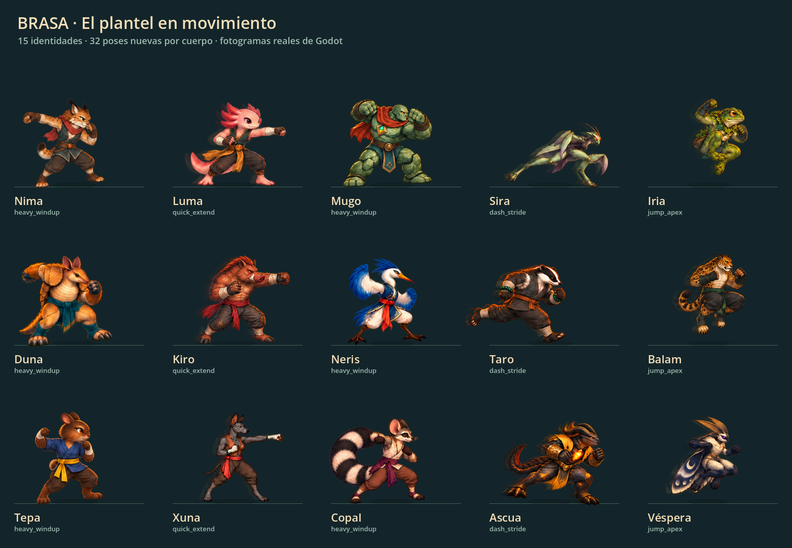
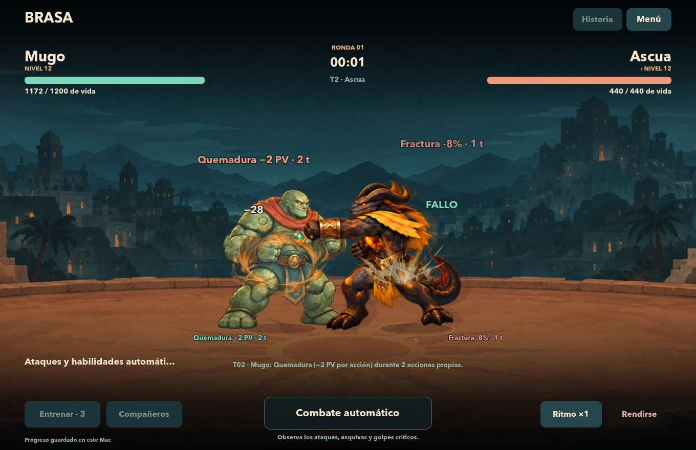
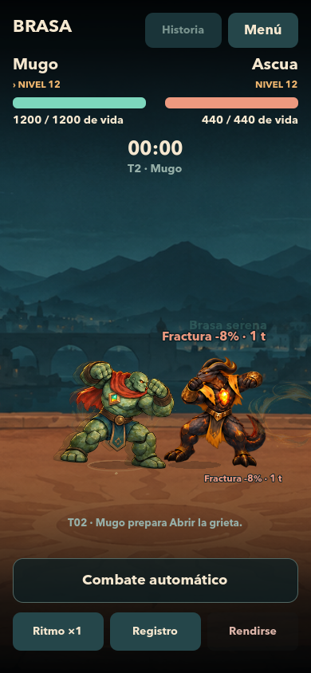

# Secuencias de combate para todo el plantel

Los 13 compañeros y los dos jefes cuentan con 32 poses nuevas por cuerpo: **480 fotogramas en 30 atlas transparentes**, integrados en combate y repetición. La especificación procede del [enlace compartido](https://chatgpt.com/s/t_6ab06420418c8191a4a456f505cb9a2e); se conserva una [copia del texto de referencia](ANIMATION-REFERENCE.txt). El enlace contiene instrucciones de animación, no un paquete de imágenes descargable.



[Video de combate en Godot](animation-combat.mp4). Partida de prueba determinista Mugo–Ascua, con datos de fixture explícitos y sin recompensas al perfil del jugador.





## Qué cambia al jugar

Las acciones recorren preparación, desplazamiento, contacto, seguimiento y recuperación. Golpes rápidos y pesados, cargas, saltos, réplicas, guardias, técnicas y firmas tienen secuencias distintas. Las fases usan los tiempos que ya entrega el motor; la cantidad de poses no modifica el momento del daño.

Las reacciones distinguen golpes leves, de cuerpo, pesados, críticos, retroceso y derribo. El derribo incluye caída y levantada; la derrota termina en la pose canónica de KO. El evento letal interrumpe cualquier acción pendiente de inmediato, incluidos ticks de estados, y la pantalla de resultado no reinicia esa caída. Un golpe no letal recibido durante una acción propia conserva el ataque autoritativo y aplica retroceso visual antes de completar la reacción pendiente.

Ocho efectos pintados se componen por separado: impacto leve, pesado, crítico, polvo, estela de desplazamiento, polvo de aterrizaje, energía y corona de transformación. Los impactos fuertes añaden una pausa visual corta y una sacudida acotada. El reloj de combate continúa siendo autoritativo. El modo de movimiento reducido elimina desplazamientos, sacudidas, pausas visuales y efectos de combate, manteniendo las poses y los tiempos; las auras cosméticas permanecen estáticas. Los paneles pausan actores y efectos junto con el combate; la repetición aplica el mismo flujo de eventos.

Ascua incorpora la transformación visual `ember_core`, con transición de 0,72 s y duración visual de 8 s. No altera estadísticas ni añade reglas de combate. Los demás cuerpos tienen poses de concentración y energía usadas por su Firma, y el registro queda preparado para futuras transformaciones explícitas. Esta entrega no concede nuevas transformaciones de juego al resto del plantel.

## Arte entregado

| Cuerpos | Banco de movimiento | Banco de reacciones | Total nuevo |
| --- | ---: | ---: | ---: |
| Nima, Luma, Mugo, Sira, Iria, Duna, Kiro, Neris, Taro, Balam, Tepa, Xuna, Copal, Ascua, Véspera | 16 por cuerpo | 16 por cuerpo | 480 poses |

Cada generación utilizó el atlas aprobado del cuerpo como referencia. Los 32 archivos canónicos registrados al inicio conservan su hash. Los PNG nuevos se copiaron directamente de la salida del generador; no se retocaron sus píxeles con scripts. Las regiones de `AtlasTexture`, pivotes y alturas compartidas están en JSON. Las poses agachadas, caídas o en el aire mantienen la escala del cuerpo y su suelo virtual; no se normaliza cada pose por su propia altura.

Se utilizó la herramienta integrada `image_gen`. No expone un selector de versión «2.5», por lo que no se atribuye esa versión a los resultados. El [manifiesto de assets](../assets/sprites/sequences/manifest.json) enumera destinos, fuentes, hashes, transparencia, memoria base y nombres de los 480 fotogramas. El historial completo de prompts y correcciones está en [animation-provenance](animation-provenance/); los prompts referenciados como archivos se incluyen también completos en [referenced-prompts.json](animation-provenance/referenced-prompts.json). La procedencia de los efectos está en [fx-provenance.json](animation-provenance/fx-provenance.json).

| Banco | Nombres semánticos |
| --- | --- |
| Movimiento | `guard_shift`, `step_back`, `charge_crouch`, `heavy_windup`, `quick_windup`, `quick_extend`, `follow_through`, `recovery`, `dash_lean`, `dash_stride`, `jump_start`, `jump_apex`, `jump_strike`, `jump_fall`, `landing`, `guard_settle` |
| Reacciones | `light_hit`, `body_hit`, `heavy_hit`, `critical_stagger`, `fall_start`, `fall_mid`, `grounded`, `getup_support`, `getup_kneel`, `getup_rise`, `low_health`, `victory_start`, `victory_peak`, `transform_start`, `transform_peak`, `transformed_idle` |

## Integración y coste

`FighterAnimationSet` resuelve el cuerpo equipado, carga sólo los bancos utilizados y conserva una caché LRU de seis bancos. Antes de comenzar el combate o una repetición se preparan los dos bancos de cada actor. Los retratos estáticos siguen utilizando el atlas original. Las 30 imágenes ocupan 43.811.042 bytes; cargarlas todas simultáneamente supondría unos 180 MiB base RGBA, por eso no se precargan globalmente. El límite de caché no representa un límite total de memoria: también existen texturas originales, efectos, fondos y referencias activas.

La lectura de límites visibles usa operaciones nativas de imagen en vez de recorrer un millón de píxeles desde GDScript. En la medición local de carga fría, los dos bancos del piloto pasaron aproximadamente de 93/109 ms a 22/25 ms; la preparación anterior al combate evita trasladar ese trabajo al primer impacto. Es una medición local, no una garantía para otros dispositivos.

Las regiones de movimiento se encuadran con una envolvente fija que incluye colas, alas, rotación y retroceso. Móvil, tableta y repetición comparten el cálculo. A 390 px de ancho, el cuerpo de referencia conserva unos 136 px de altura y no cambia de escala al pasar de reposo a combate o resultado. No se corrige el encuadre desplazando o redimensionando cada pose.

Para ampliar el sistema, se añaden bancos y sus sidecars al directorio `assets/sprites/sequences`, se registran clips en `FighterAnimationSet` y efectos en `data/combat_fx.json`. Los campos opcionales `move.presentation` y `event.presentation` permiten elegir reacción, efecto, pausa visual y cámara. El atacante recupera la definición recibida en `move_started` mediante el `move_id` del impacto, tanto en Main como en repetición, sin modificar el evento autoritativo. Se validan los valores; la configuración explícita del evento tiene prioridad sobre la del movimiento, y un KO o un fallo conservan su prioridad semántica.

## Verificación reproducible

Resultado consolidado: **15.538 comprobaciones en nueve ejecuciones de validación, cero fallos**. Las seis suites de dominio se repitieron con los 30 bancos instalados; se suman efectos, KO por estados y el recorrido nativo continuo.

El piloto de Ascua pasó la revisión nativa antes de ampliar los otros 14 cuerpos. La entrega completa incluye un control estricto que exige 30 bancos, 480 fotogramas reales, transparencia, regiones válidas y ausencia de fallback. El barrido continuo comprueba todos los cuerpos en ambas orientaciones y distintos tamaños de pantalla.

Las pruebas de combate usan fixtures y rutas de salida aisladas; no conceden progreso al perfil del jugador. Los hashes de `combat_engine`, `combat_rules`, `story_progression`, `progression`, `fighter_identity`, `move_catalog` y `campaign_config` coinciden con la base anterior a este cambio. No se cambian daño, RNG, recompensas ni formatos de guardado.

Desde la carpeta del proyecto:

```sh
BRASA_GODOT="/Applications/Godot.app/Contents/MacOS/Godot"
"$BRASA_GODOT" --headless --path . --script res://tests/test_animation_sequences.gd -- --require-roster
"$BRASA_GODOT" --headless --path . --script res://tests/test_combat_fx.gd
"$BRASA_GODOT" --headless --path . --script res://tests/test_status_ko_presentation.gd
"$BRASA_GODOT" --headless --path . --script res://tests/test_battle_layout.gd
```

La ejecución nativa final pasó **1.116 comprobaciones. sin fallos**, y guardó 96 observaciones temporales de ambos actores: combate y repetición en 1360×880 y 390×844. Verifica avance continuo de poses, contacto, caída, pausa, geometría y consistencia del reloj. Las capturas provienen del árbol de escena en ejecución; no se forzó una pose para simular un contacto. Los tiempos reales de captura están registrados y pueden diferir del instante solicitado por el coste de leer y guardar la imagen.

La prueba integrada de presentación pasó **91 comprobaciones**, usando eventos reales de veneno, quemadura y sangrado, con resultado y persistencia sustituidos por memoria. También verifica que la configuración visual de un movimiento llegue al impacto, sus prioridades y la inmutabilidad de los eventos y registros históricos. Los efectos pasaron **43 comprobaciones**. El control completo de atlas y secuencias pasó **6.218 comprobaciones**, y el encuadre **2.139**, sin bajar el mínimo previo de legibilidad en móvil.

Los [resultados nativos](animation-native-results.json) y su [manifiesto de fuentes](animation-native-manifest.json) documentan el entorno y los hashes. En el Mac de prueba, la mediana fue 16,67 ms por fotograma y el percentil 95 osciló entre 16,67 y 20,83 ms durante las capturas; este recorrido incluye lectura y escritura de PNG y no constituye un benchmark aislado. El resumen de todas las suites de esta entrega está en [animation-validation.json](animation-validation.json).
