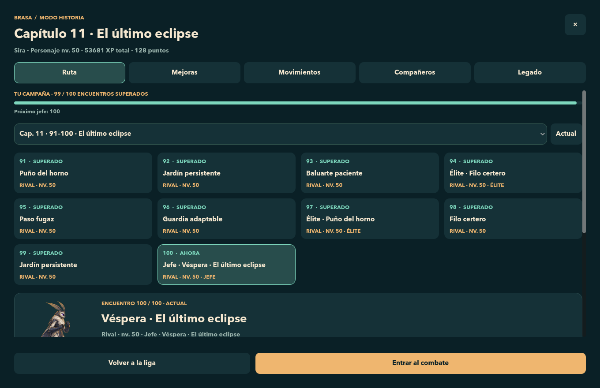
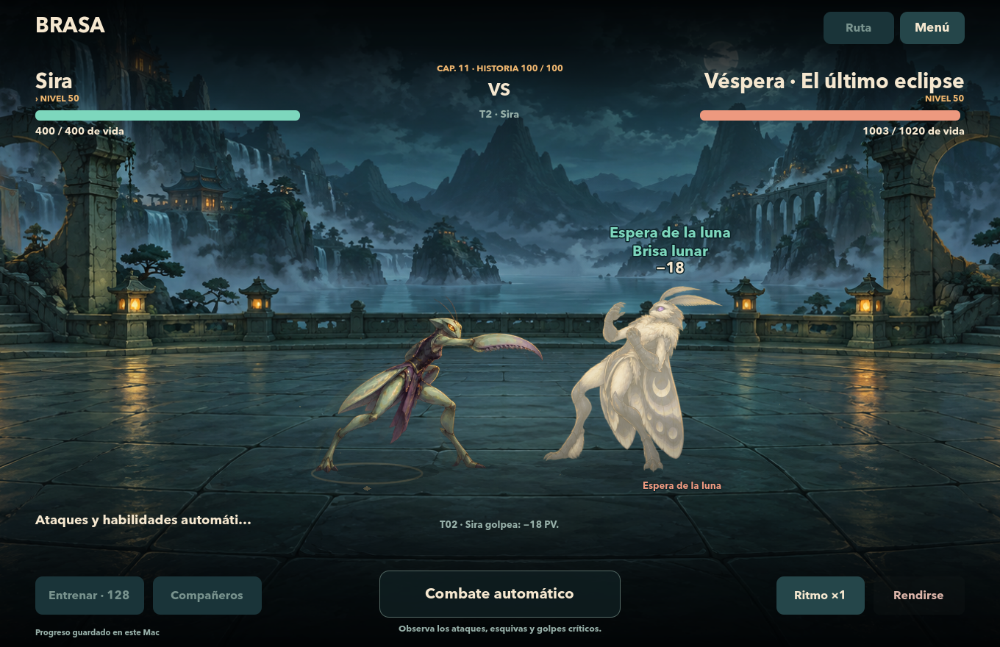
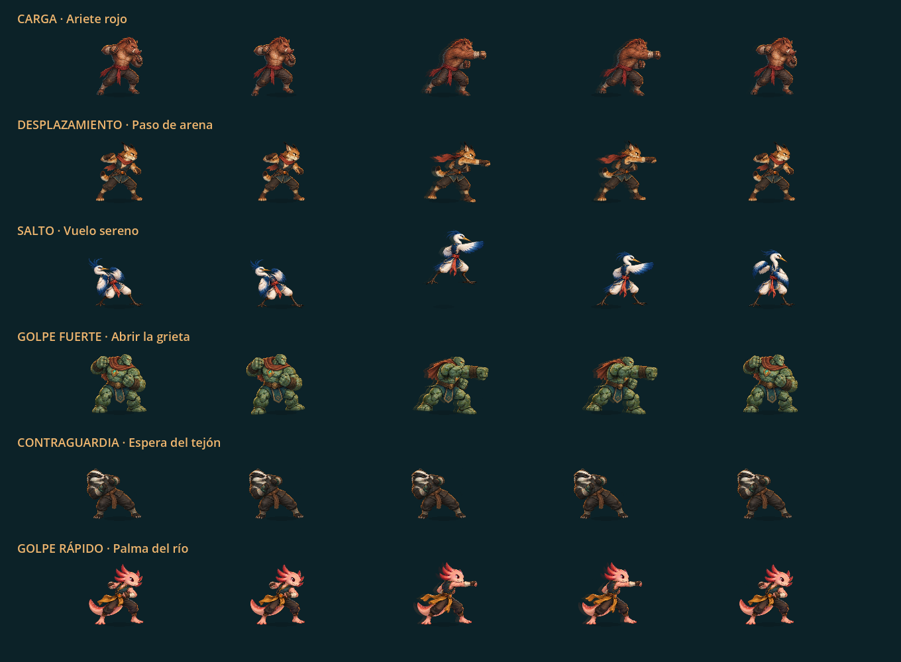

# Brasa · Campaña de 100 encuentros y técnicas

Validación local del 20 de septiembre de 2026, Godot 4.7.2 para macOS.

## Entrega

La Historia crece hasta **100 encuentros en 11 capítulos**. Los primeros 16 conservan sus identidades y orden, incluido Nima en el encuentro 2. La liga mantiene su guardado y progresión propios. Hay nueve compañeros y versiones especiales de Ascua y Véspera; cada uno cuenta con cinco técnicas definidas en datos, además de su habilidad y Golpe Firma originales.

El personaje empieza con dos técnicas y desbloquea las demás en niveles de personaje 5, 12 y 20. Las técnicas tienen preparación, desplazamiento, impacto y recuperación separados: las cargas retroceden antes de avanzar, los saltos describen distintas trayectorias y las posturas defensivas permiten respuestas probabilísticas. El motor aplica el daño al contacto y usa los límites y fórmulas comunes de combate. La IA considera vida, estados, enfriamientos, velocidad y acciones anteriores.

Diez hitos de Historia conceden fichas para mejorar las cinco técnicas hasta dos grados. Los encuentros 10, 30 y 50 ofrecen una elección de talento entre seis opciones vinculadas al personaje. Los puntos de atributos son tres por nivel hasta el 20 y dos después; la migración conserva los puntos ganados en partidas anteriores.

El mapa muestra avance global, próximo jefe, recompensas y rivales conocidos. Los encuentros normales pueden elegir rivales de un conjunto estable durante cada campaña; los jefes conservan su identidad. Los encuentros 50 y 100 tienen versiones especiales de Ascua y Véspera con fases anunciadas. La pantalla previa presenta estilos, fortalezas, debilidades, movimientos y habilidades; las pistas tras perder usan los datos de esa pelea.

Los encuentros superados se pueden repetir como práctica sin XP ni premios adicionales. Las derrotas de la ruta dan menos XP que las victorias y reducen su recompensa al repetirse. **Redistribuir mejoras** devuelve únicamente recursos ya gastados, permite cambiar de estrategia y exige confirmar dentro del juego. Conserva nivel, XP y avance; los legados guardan la configuración con la que se venció cada capítulo.

La opción de movimiento reducido elimina desplazamientos, destellos y partículas manteniendo poses y tiempos. Ritmo ×2 sincroniza simulación y animación; los paneles pausan ambos.

## Compatibilidad comprobada

- Historia v3 lee v1/v2 sin escribir al abrir ni avanzar capítulos. Antes de la primera escritura guarda una copia permanente del formato anterior, además de respaldo habitual y reemplazo atómico.
- Una copia reciente de la partida real v2 pasó **11 comprobaciones** de migración, recursos, archivos originales, respaldo y recarga. La partida real se mantuvo fuera de las pruebas.
- Se reabrió la aplicación final y se comprobó visualmente Sira en nivel 15, con 205 XP, tres puntos y diez encuentros superados. La pantalla reconoció cuatro técnicas, dos fichas y una elección de talento disponibles por los hitos anteriores.
- Los hashes SHA-256 de los archivos reales de Liga e Historia fueron idénticos antes y después de reabrir y navegar por la actualización.
- El Golpe Firma conserva una tirada del 1% por luchador al comienzo de cada combate y un máximo de una ejecución. Las nuevas técnicas no repiten esa tirada.

## Pruebas automáticas

**21 suites, 18,498 comprobaciones y cero fallos**, más las 11 comprobaciones de la copia real. El detalle y los hashes de los scripts están en [campaign100_validation.json](campaign100_validation.json).

Se verificaron reglas, técnicas y talentos, probabilidades y estados, sincronización al contacto, contraataques que coinciden con otra preparación, pausa y velocidad ×2, animación reducida, migraciones y datos malformados, persistencia, liga, plantel, sprites, recompensas únicas, rendición, progresión y legado de los capítulos, campaña completa, repetición y redistribución.

Las pruebas de interfaz cubren siete tamaños y estados de reposo, combate y resultado. Se generaron **39 capturas nativas**: 35 del panel de Historia, tres de la escena principal y una hoja de movimientos. Las capturas y la prueba del flujo 1–100 usan partidas independientes y victorias controladas para comprobar transiciones; el balance se mide por separado con combates naturales.

## Balance

Se ejecutaron **17,610 combates** en la validación final:

| Ejercicio | Combates | Resultado |
| --- | ---: | --- |
| Nueve personajes × cuatro builds fijas × tres repeticiones | 13,135 | 107 de 108 campañas completadas dentro del límite de 24 intentos por encuentro. |
| Nueve personajes × cuatro builds con redistribución tras atascarse | 4,314 | 36 de 36 campañas completadas. |
| Reproducción exacta del único bloqueo y recuperación con redistribución | 161 | Duna ofensiva llegó al mismo bloqueo del encuentro 100; la build equilibrada terminó ocho combates después, conservando XP y ruta. |

Los nueve personajes y las cuatro estrategias tuvieron campañas completadas. El jefe 50 se venció al primer intento en aproximadamente el 54% de la muestra fija y el jefe final en el 39%. Los combates duraron alrededor de 31 segundos de simulación en promedio. Estos resultados acotan el comportamiento de las semillas y estrategias medidas; no garantizan que toda distribución de puntos venza en un número fijo de intentos.

El [informe de balance](CAMPAIGN100_BALANCE.md) documenta configuración, curvas, personajes, movimientos y límites de la medición. Los datos reproducibles están en [campañas fijas](campaign100_balance.json), [campañas con adaptación](campaign100_adaptation.json) y [recuperación del bloqueo](campaign100_recovery.json). El simulador usa el motor y las recompensas reales, con semillas reproducibles y guardado desactivado.

## Capturas

### Ruta final

### Combate contra el jefe final

### Preparación, desplazamiento, contacto y recuperación

También se incluyen [Legado del capítulo final](campana100-legado.png) y [talentos en pantalla vertical](campana100-movil.png).

## Reproducir

El [README](../README.md) contiene las instrucciones para abrir el proyecto y ejecutar las pruebas. Los catálogos `move_catalog.gd`, `campaign_config.gd` y `story_catalog.gd` centralizan técnicas, curvas, hitos, variantes y capítulos. Las simulaciones y pruebas viven en `tests/`; modificar esos datos permite ampliar la campaña conservando el motor común.
