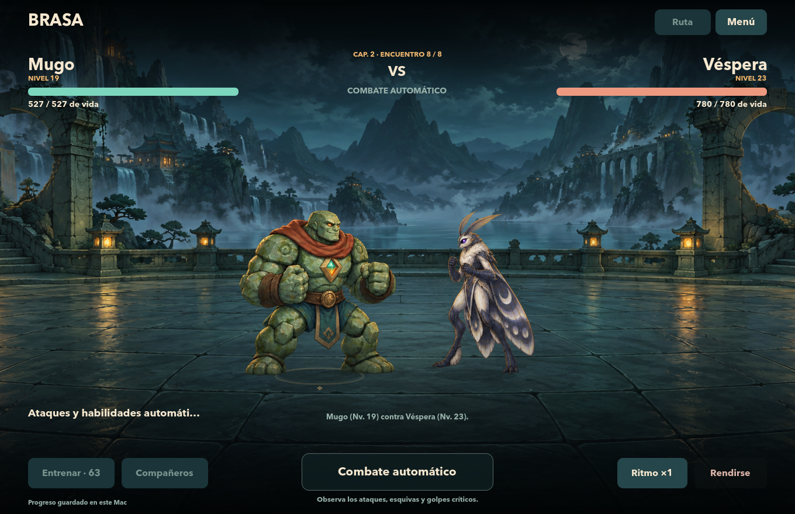

# Level 2 restored and Chapter 2 added

Nima, the second rival of the first route, is now level **2**. The encounter retains its identity, declared statistics, reward, and position; level adjustment uses the same combat rules. The interface distinguishes **Chapter**, **Encounter** number and **rival/character level** to avoid confusing the three progressions.

The second chapter, **The Passage of the Storm**, adds eight encounters and is unlocked after Ascua. Includes rivals of levels 13–23, two elites and the boss **Véspera**, a moon moth with high speed and evasion with light armor. Story Mode has sixteen encounters between the two routes. The new stage and all eight poses of Véspera were generated with native `image_gen`.



## Continue and preserve the legacy

At the close of the first chapter, **Legacy → Start Chapter 2** starts the new route. Level, XP, available points, upgrades, assignment history, and accumulated XP are retained. A copy of the profile and summary of the first chapter is on file; new fights and retries are counted separately. The Legacy selector allows you to consult both closures.

The Story Mode save changes to version 2. Loading a v1 game interprets it as Chapter 1 and does not write the file or start the continuation. The first write preserves a permanent copy `.v1.bak`, in addition to the rotating backup and atomic write. If saving the transition fails, it returns to the previous state. Rewards verify character, chapter, and encounter and preserve deduplication between chapters.

The league retains its adapter, file and stage. The storm background is used in the second chapter; returning to the league recovers the night market.

## Verification

Godot 4.7.2: **9981 checks, zero failures**.

| Suite | Checks |
| --- | ---: |
| Core | 185 |
| league combat | 396 |
| Original sprites | 258 |
| Squad | 283 |
| Battle distribution | 2139 |
| Different sprites | 3165 |
| Combat and Story Mode Catalog | 518 |
| First chapter campaigns | 1563 |
| Original Story Mode Integration | 85 |
| Story Mode panel with chapters | 429 |
| Integration of the two chapters and native captures | 444 |
| Chapters, migration, legacies and Véspera | 299 |
| Story Progression | 217 |

The integration uses the actual interface and engine with separate test files. Covers all sixteen wins, losses, and retries in the second chapter, one-time rewards, reloading, both legacy screens, button transition, and league recovery. The forced victories of these tests check the flow, not the balance.

The visual review covers seven sizes: 1360×880, 1224×792, 1920×1080, 768×1024, 390×844, 430×932, and 844×390. The 28 integration snapshots are persisted in `work/level2/chapter-integration-captures`, relative to the workspace root; the panel captures are in `work/level2/panel-qa`. Checked headers, numbering, preview, continue button, Véspera, life bars, stage and controls.

An **isolated copy of the actual v1 game of Sira** was also tested: the start of the second chapter and its reload preserved 12 level, XP, points, stats, upgrades and the full legacy. The `.v1.bak` copy matched byte for byte. The actual game was reopened and the Nima level 2 card and continuation access in Legacy were verified. The two actual files retained their SHA-256 during the reboot and that navigation; Chapter 2 was not started by the player.

## natural balance

The final sample uses the real engine and progression, without modifying life or forcing victories: **3182 battles and 108 campaigns**, with all nine characters, four upgrade priorities and three seeds per combination. **108 by 108** completed both chapters. The second needed an average of **12.89 fights**, with a range of **8–19**, and ended with a medium level **21.71**, within **20–23**. Véspera fell on the first try in **63.89%** of the campaigns.

The final profile of Véspera has 780 HP, 52 Attack, 30 Defense, and 20 Speed. Its declared phases add 10% speed to 60% health and 8% attack to 30%; He doesn't cure or ignore the rules. His signature maintains the single 1% roll per combat and temporarily reduces accuracy. The levels, states, probabilities and limits remain those of the common system.

They are results from a finite sample; They do not guarantee the same difficulty for all distributions. [Simulation data](story_chapters_balance.json) · [Balance report](STORY_CHAPTERS_BALANCE.md).

## Files and playback

[Scenario, atlas and exact prompts](../assets/CAPITULO-2.md) · [Mobile view](capitulo2-movil.png) · [Unlocking the continuation](capitulo2-desbloqueo.png).

From the project folder:

```sh
/Applications/Godot.app/Contents/MacOS/Godot --headless --path . --script res://tests/test_story_chapters.gd
/Applications/Godot.app/Contents/MacOS/Godot --headless --path . --script res://tests/test_story_chapter_integration.gd
/Applications/Godot.app/Contents/MacOS/Godot --headless --path . --script res://tests/simulate_story_chapters.gd -- --quick --output=res://reports/story_chapters_balance.json
```
