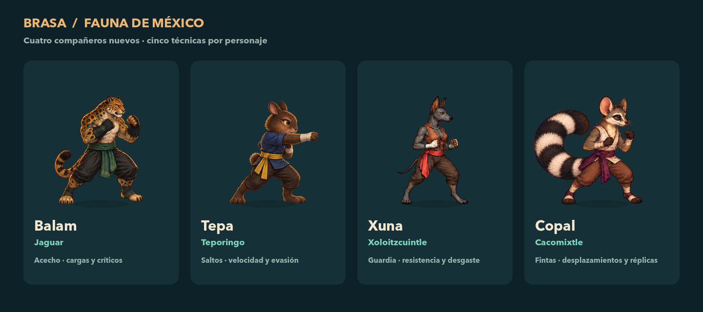
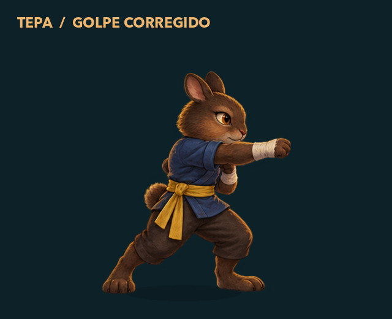

# Fauna mexicana en Brasa

**Cuatro personajes nuevos; 13 jugables en total.** Cada uno tiene cinco técnicas, seis opciones de talento —se pueden elegir tres— y ocho poses propias con transparencia.

| Personaje | Inspiración | Estilo |
|---|---|---|
| Balam | Jaguar | Acecho, cargas y críticos. |
| Tepa | Teporingo | Saltos, velocidad y evasión. |
| Xuna | Xoloitzcuintle, raza mexicana de perro | Resistencia, guardia y desgaste. |
| Copal | Cacomixtle | Fintas, desplazamientos y contraataques. |

Los cuatro atlas se generaron con la herramienta nativa de imágenes. Cada archivo final es idéntico, byte por byte, a su fuente generada y conserva ocho poses en RGBA de 1774 × 887. La anatomía del golpe de Tepa se corrigió a partir de la observación del usuario; se revisaron sus ocho poses y el resultado dentro del combate. También se verificó que las colas y extremidades completas se mantienen visibles en las fichas y la arena móvil.

El [informe de arte](../assets/sprites/FAUNA-MEXICANA.md), los [prompts completos](../assets/sprites/fauna-mexicana-prompts.md) y el [manifiesto de fuentes y hashes](../assets/sprites/fauna-mexicana-origen.json) conservan la procedencia de los cuatro atlas finales.

## Validación final

| Comprobación | Resultado |
|---|---:|
| 22 suites de dominio, interfaz, combate y campaña | 22.707 checks; 0 fallos |
| Smoke de interfaz | PASS |
| 3 suites con renderizado nativo | 5.167 checks; 0 fallos |
| Persistencia sobre copias aisladas de los guardados actuales | 318 checks; 0 fallos |
| Capturas nativas de revisión | 40 PNG: 6 de combate/galería, 23 de sprites, 11 de fichas/plantel |

Los 23 logs principales incluyen las 22 suites y el smoke. Las pruebas nativas vuelven a comprobar el comportamiento con renderizado; sus cifras se presentan por separado. Se revisaron la galería, el golpe corregido, las ocho poses de Tepa y Copal, combate y ficha móvil de Copal, y el plantel horizontal. Los [resultados estructurados](fauna-mexicana-validation.json) registran cada log y su hash, capturas, arte y fuentes de balance.

## Balance y progreso

La simulación final completó **48/48 campañas de 100 encuentros**, con cuatro prioridades y tres semillas por personaje: **14.082 combates**, de los cuales 8.320 son duelos de Liga y 5.762 de Historia. Las veinte técnicas nuevas se utilizaron. La media fue de 120,04 combates por campaña y 30,22 segundos por combate. El [informe de balance](MEXICAN_ROSTER_BALANCE.md) detalla estadísticas, jefes, builds y límites de la muestra; los seis hashes de sus fuentes coinciden con el código final.

Los nuevos IDs se añaden después de los nueve existentes. Se conservan las definiciones antiguas, los primeros 16 encuentros y los pools de la campaña. Las pruebas de persistencia comprueban la selección de los cuatro personajes, sus perfiles independientes en Liga e Historia y el regreso a los perfiles y Legados existentes sin perder campos. La comprobación de 318 checks se ejecutó sobre copias aisladas; no se repitió al preparar este documento.

La aplicación se reabrió y los dos guardados reales conservaron exactamente los mismos bytes, verificados por SHA-256 antes y después. No se reinició ningún perfil.
