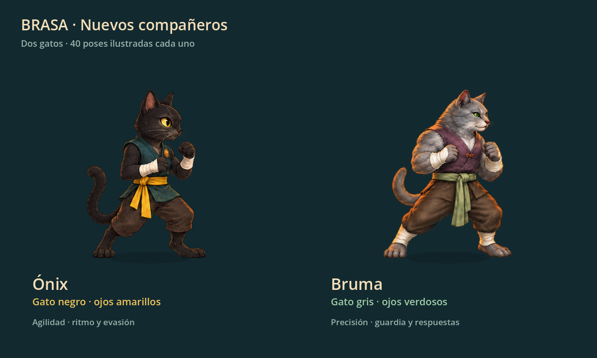
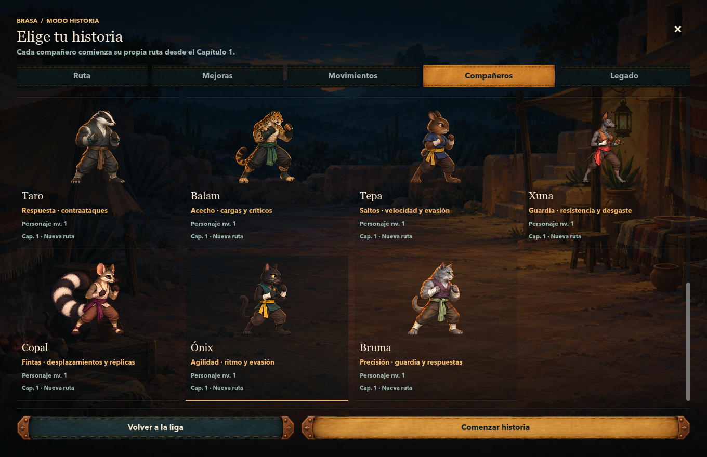

# Ónix y Bruma

Dos nuevos compañeros jugables: **Ónix**, gato negro de ojos amarillos, y **Bruma**, gato gris de ojos verdosos. Se añaden al final del plantel, conservando los índices de los 13 personajes anteriores. Hay 15 compañeros y dos jefes.

Se eligen desde **Liga → Compañeros** y **Historia → Compañeros**. Cada uno tiene progreso independiente, cinco técnicas, seis talentos y Golpe Firma. Ónix favorece velocidad, combos y evasión; Bruma favorece precisión, defensa y contraataques. Los valores, técnicas y 6,768 combates de balance se documentan en [CAT_ROSTER_BALANCE.md](CAT_ROSTER_BALANCE.md).

## Arte y animación

Cada gato tiene tres atlas transparentes: ocho poses canónicas, dieciséis de movimiento y dieciséis de reacción. Son **80 poses nuevas en seis PNG**. Incluyen preparación, ataques, carrera, salto, recuperación, impactos, caída, levantarse y victoria. Usan el reproductor de animación existente, también al personalizar otro arquetipo con su cuerpo.

Las imágenes se generaron y corrigieron con el **modo integrado `image_gen` de ChatGPT**. La herramienta no expone un selector verificable llamado «Image 2.5». La transparencia se produjo con esa misma herramienta; los PNG aceptados se copiaron sin modificar sus píxeles. Godot usa regiones y anclas JSON, con una escala corporal común por atlas. No se sustituyeron imágenes anteriores.

- [Atlas, regiones, hashes y comprobación de fuentes](../assets/sprites/GATOS.json).
- Ónix: [prompts completos](cats-provenance/onix-prompts.json), [historial de generación](cats-provenance/onix.json), [movimiento](cats-provenance/onix-movement.png), [reacciones](cats-provenance/onix-reactions.png).
- Bruma: [prompts completos](cats-provenance/bruma-prompts.json), [historial de generación](cats-provenance/bruma.json), [movimiento](cats-provenance/bruma-movement.png), [reacciones](cats-provenance/bruma-reactions.png).

El plantel completo tiene ahora **34 bancos y 544 poses adicionales**, además de las ocho poses canónicas de cada cuerpo. El [manifiesto actual](../assets/sprites/sequences/manifest.json) incluye los dos gatos. El [manifiesto anterior](animation-manifest-before-cats.json) conserva la procedencia de la entrega de 480 poses.

## Partidas anteriores y servidor local

Las reglas de combate y los formatos de progresión de Liga e Historia se conservan. La identidad cosmética pasa de v1 a v2 para que un inventario anterior pueda acceder a los dos cuerpos gratuitos sin perder nombres, IDs, equipo ni recompensas. D1 incluye la migración 0005 y una concesión única al sembrar el catálogo. [Detalle y pruebas de compatibilidad](CAT_IDENTITY_MIGRATION.md). El backend local comparte los 15 personajes, 75 técnicas y 90 talentos; sus batallas siguen usando el motor autoritativo y las mismas reglas que Godot.

Esta ampliación se prueba con archivos y cuentas desechables. No requiere abrir las partidas reales ni publicar en Cloudflare.

## Verificación

**16,511 comprobaciones de Godot en 11 suites y 365 pruebas del backend, sin fallos.** [Resumen verificable](cats-validation/summary.json) · [logs de Godot](cats-validation/headless-checks.json) · [log del backend](cats-validation/backend-tests.log).

| Comprobación | Resultado |
|---|---:|
| Datos, técnicas, progresión y partidas anteriores | 721 |
| Migración de identidad anterior | 95 |
| Atlas canónicos de los 17 cuerpos | 5,419 |
| 34 bancos de animación, encuadre y ambos sentidos | 7,010 |
| Identidad cosmética y persistencia | 982 |
| Integración de identidad en Main | 86 |
| Errores de guardado y repeticiones | 28 |
| Compatibilidad del plantel mexicano anterior | 816 |
| Interfaz online y vistas previas de los gatos | 758 |
| Paneles de Historia en siete tamaños | 443 |
| Recorrido nativo de ambos gatos | 153 |

El recorrido nativo selecciona, personaliza, combate, recompensa y recarga ambos personajes en **1360×880** y **390×844**, en Liga e Historia. Las ocho capturas de batalla se toman durante contactos observados del motor activo, sin imponer un fotograma o resultado. [Registro de capturas](cats-validation/native-observations.json).

Se ajustó la ficha para mostrar una sola vez las biografías repetidas y se dio altura suficiente a las tarjetas de Historia para que se lea su última línea. Los **92 archivos de arte anteriores** conservan exactamente sus hashes. No se cambiaron fórmulas de combate ni perfiles anteriores del catálogo.

La validación de equilibrio incluye **6,768 combates** y **16/16 campañas completas de 100 encuentros**; los resultados y sus límites están en el informe de balance.

[Combate de Ónix en escritorio](cats-validation/battle-onix-1360x880.png) · [Combate de Bruma en móvil](cats-validation/battle-bruma-390x844.png) · [Ficha de Ónix](cats-validation/league-onix-390x844.png).
