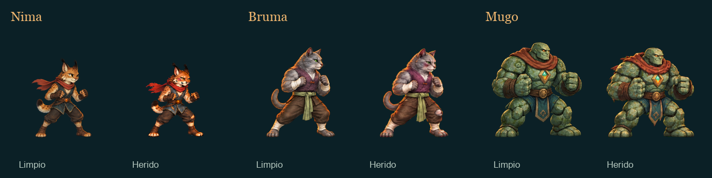

# Brasa · Illustrated damage across cast

> Production update: [scale, transparency and localized damage](SPRITE-PRECISION.md). This revision replaces the historical visual hashes and benchmarks in this document.

The face, clothing and posture show wear and tear within the painting itself. This release replaces the procedural smudges and streaks of the previous implementation with a complete wound library for **23 visual bodies**, preserving the identity and materials of each.

[Report index](README.md) · [Sources, Prompts, and SHA-256](illustrated-damage/manifest.json) · [Native QA Status](illustrated-damage/native-qa.json).

The montage comes from the production PNGs, with the same cell and scale. It's a static technical comparison, not a combat capture.

## Coverage and states

**22 bodies receive new art; Ascua reuses your three previously existing critical-v1 banks.** Each body has eight base poses, sixteen movement and sixteen reaction: **920 poses in 69 PNG/JSON pairs**. All six family appearances and two bosses are included. The selection follows the effective visual body, which may differ from the combat archetype.

| Status | Library used |
| --- | --- |
| Prepared · grade 0 | Existing clean art. |
| Worn · grade 1 | Clean art and existing fatigue poses, no procedural marks. |
| Damaged · grade 2 | Complete wounded family of 40 poses. |
| Critical · grade 3 | The same wounded family of grade 2. It does not represent another level of generated art. |

The submission thresholds remain 72 %, 45 %, and 22 % minimum observed lifetime. The transition is coordinated with the reaction; The range of a blow does not change illustration mid-contact. Healing during a fight does not repair clothing. The outcome preserves the state and a new battle restarts it.

The torn clothes, the bruised face and the tired posture persist in preparation, blow, displacement, jump, retort, fall, incorporation, victory and transformation. There is no added blood, foreign equipment or a layer of floating marks. Cosmetic tint and impact flash remain separate functions; eliminating procedural wear does not require eliminating them.

## Bodies included

| Set | Bodies |
| --- | --- |
| Initial cast | Nima, Luma, Mugo, Sira, Iria, Duna, Kiro, Neris and Taro. |
| Mexican fauna | Balam, Tepa, Xuna and Copal. |
| Cats | Ónix and Bruma. |
| Bosses | Ascua and Véspera. |
| Taro Family | Roque and Sabino. |
| Duna Family | Cora and Pedernal. |
| Bruma Family | Ámbar and Nieve. |

Materials are resolved from each reference: chipped stone and worn cloth in Mugo; fur and clothing in Bruma; skin, membranes or shell when applicable. Eye color, species markings, recognizable clothing and equipment are preserved. The stooped posture should not increase the size of the head or shorten the limbs.

## Real alpha and preparation

New originals are preserved with their hash. They were generated on a flat extraction background —green or magenta when the figure requires keeping green—, with a historical exception of a checkered background in the Nima pilot. Authorized cleaning removes the background also within the gaps between arms, legs, tails and clothing. Ascua preserves the three accepted critical PNGs byte by byte.

The extraction acts on alpha. The normalization uses premultiplied RGB and a bilinear filter of positive weights to avoid invented green pollution on semi-transparent edges. Exceptions of gaps or surfaces that share the background color are recorded using specific polygons linked to the SHA of the source, without indiscriminately reclassifying all clothing or skin. Not all small components are erased: they can be fingers, fringes or legitimate parts of the drawing.

The final PNGs are RGBA with true transparency. The numerical chroma check does not replace the review of light and dark backgrounds: you must check holes, eyes, color, anatomy, complete pieces and absence of halo. The board allows you to change the background and zoom in on each pose. Their thumbnails reduce the entire atlas to 50 %; They do not adjust each silhouette separately or modify the production originals.

## Scale, supports and contact

The contract remains in cells of **512 × 512**, pivot **256/448** and **1,5 pixels per unit**. Each bank uses a single scalar. A wounded figure may be lower because of its posture; It does not inflate until the clean box is filled. The camera and physical proportions of each species remain shared with the rest of the game.

The metadata describes the effective wound box, including region, alpha boundaries, root, and provenance. The support obtained by projection is expressly identified as **approximate**. No inherited hand or torso sockets are presented as anatomical measurements on new drawings.

When an annotated hand is missing, the renderer uses the **painted leading edge of the hitting pose** as an approximation of the visual range (`painted_strike_edge`). This solution is not a collider, hitbox, or logical scope change. Auxiliary anchors without annotation can use the general profile references; require native review to verify placement. The damage cache is limited to six banks and each body is validated as a complete set before its wounded family is enabled.

They do not change HP, stats, initiative, RNG, techniques, results, rewards, inventory or saves. The work modifies the representation of already existing events, not the rules that produce them.

## Technical validation available

[source and reference preservation](illustrated-damage/evidence/final-art-preservation.json) passed **276 checks, 0 failures**: original source, clean references when checked in, and production PNG/JSON hashes. All three PNGs in Ascua are identical to critical-v1. The pipeline passed **23 tests, 0 failures**. These figures verify preparation and origin; They are not results of the native presentation.

## Final QA and limits of evidence

- **3832 native checks, 0 failures:** 23 bodies, 368 samples and 39 PNG. Guard, Punch, Reaction, and KO are tested on 1360 × 880 and 390 × 844, in both directions. [Result](illustrated-damage/native/validation.json) and [39 hashed copies](illustrated-damage/native-manifest.json).
- **Six headless suites, 56 484 checks, 0 failures:** illustrated damage, families, contact, sprites, movement clock and status KO. The figure **includes** the strict gate of 14 977 checks that confirms 23/23 bodies and 920 poses; It is not added twice. [Consolidated regression](illustrated-damage/evidence/final-runtime-validation.json) and [coverage gate](illustrated-damage/evidence/final-runtime.json).
- **Visual review of the 39 screenshots:** [11 plates and the 16 contexts](illustrated-damage/evidence/root-native-art-review.json), plus [the other 12 plates](illustrated-damage/evidence/fighter-art-native-review.json). No art defects noted. Each slide shows four clips in two orientations—184 sprites shown between 23—not 40 single moving poses. Complete banks are reviewed separately on the technical board.

The native fixture uses production FighterView and BattleLayout, with real scenes and clips from the renderer. **Does not start Main, does not open profiles, and does not simulate victories or rewards.** Showing the common guard animation in the deck does not grant that ability to anyone who does not have it. Minimum health parity between Main and Replay is checked separately in the illustrated damage suite. Fonts and runtime remained stable during capture.

The [first pass](illustrated-damage/evidence/first-pass/validation.json) is preserved: 3878 checks and 46 failures, due to a contact advance assertion applied to unrivaled figures. This assertion was restricted to pairs, maintaining the root and framing verifications of the isolated figures. The final pass preserves 92 terminal contact checks with partner and records 46 KO samples without partner. No art was cut or runtime modified to resolve it; The final 39 PNGs are identical to the ones already reviewed.

The viewer was tested on links, hashes, and JavaScript syntax. **No browser or DOM QA performed:** Chrome was not available through CUA and local Node environments do not include jsdom, happy-dom, or linkedom. That limitation of the HTML report is not presented as proof of the game.

## Origin and history

Output: `assets/sprites/damage/illustrated-v2/<body>-<bank>.png` and Brother JSON. The [dashboard manifest](illustrated-damage/manifest.json) records approved sources, PNG/JSON hashes, clean references, available prompts, validations, and revisions. The original global manifest is at `work/illustrated-damage/final-art-manifest.json`; the dashboard maintains a [copy of global manifest](illustrated-damage/evidence/final-art-manifest.json).

[Previous delivery of families and hybrid damage](DAMAGE-AND-FAMILIES.md) is retained as history. Your description of the shader and exclusive coverage of Ascua is no longer the current implementation. The families, unlocks and other rules of that installment remain outside the scope of this visual change.
