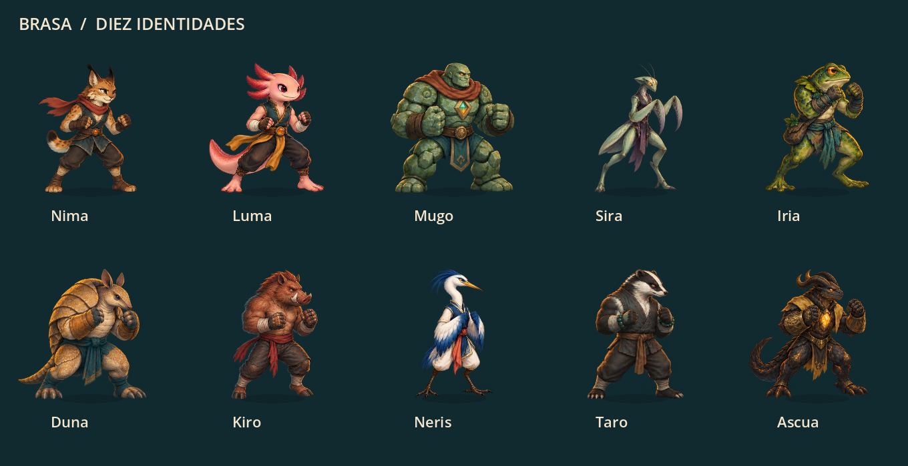

# Characters with their own sprites · Validation

The update brings seven original designs and 56 poses: Sira (mantis), Iria (botanical frog), Duna (armadillo), Kiro (boar), Neris (heron), Taro (badger) and Ascua (volcanic guardian). The squad has nine different appearances and the boss has an exclusive one.



## Integration

`character_catalog.gd` and `story_catalog.gd` declare their own atlas using `visual.atlas`. `fighter_view.gd` uses that file in all views; retains orientation, common scaling between poses, animation, flares, and compatibility with the previous API. The seven JSON regions describe each complete silhouette without retouching the generated PNGs.

Comparison with previous copies confirms that the catalogs did not change outside their visual fields. No changes were made to statistics, skills, ids, engine, rewards, or match format.

## Testing this update

Godot 4.7.2: **4555 checks, zero failures**.

| Test | Checks |
| --- | ---: |
| `test_distinct_sprites.gd` | 3165 |
| `test_sprites.gd` | 258 |
| `test_story_panel.gd` | 362 |
| `test_core.gd` | 185 |
| `test_roster.gd` | 283 |
| `test_story_integration.gd` | 85 |
| `test_story_progression.gd` | 217 |

The different sprite test checks the ten files and their unique content, the actual load of the expected atlas, the total 80 poses, transparency, anchoring to the ground, scale, orientation, animation and compatibility with missing atlases. New regions retain each visible pixel (alpha ≥ 31/255) exactly once. Seven sizes are verified: 1360×880, 1224×792, 1920×1080, 768×1024, 390×844, 430×932 and 844×390.

Native captures of all ten identities, eight poses per character, and fit across all seven sizes were reviewed. They are 18 snapshots in `work/characters/native-qa`, with respect to the root of the workspace. Tails, wings, fists and tall poses are shown complete and without fragments of other cells.

The application was restarted from `Jugar.command`. Arena checked with a new rival, Sira in Legacy and the six new skins in Story Companions. The two actual save files exactly retained their SHA-256 during reboot and final navigation. The automated tests used independent fixtures.

## Art and reproduction

[PNG, metadata, exact prompts and generation method](../assets/sprites/PERSONAJES-V3.md).

From the project folder:

```sh
/Applications/Godot.app/Contents/MacOS/Godot --headless --path . --script res://tests/test_distinct_sprites.gd
```

For the captures, the same test is used with a graphic renderer and `-- --capture-dir=/ruta/de/salida`. Does not require loading a game.
