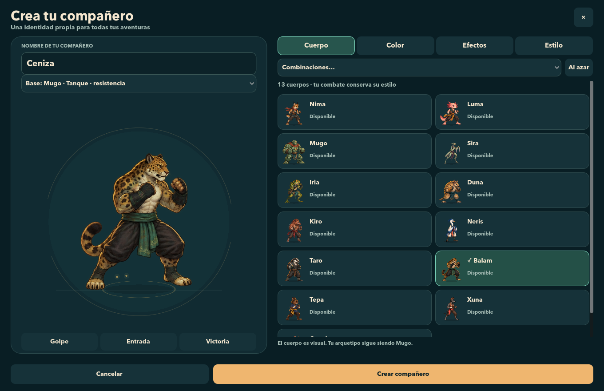
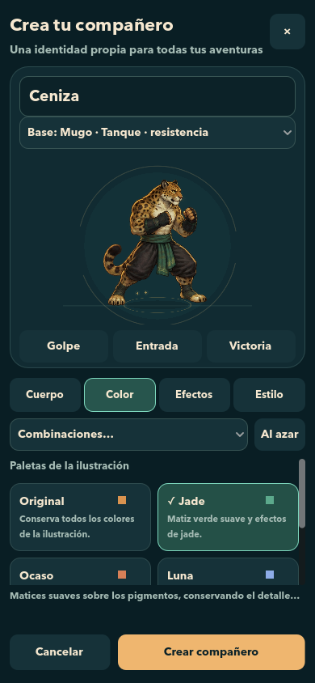
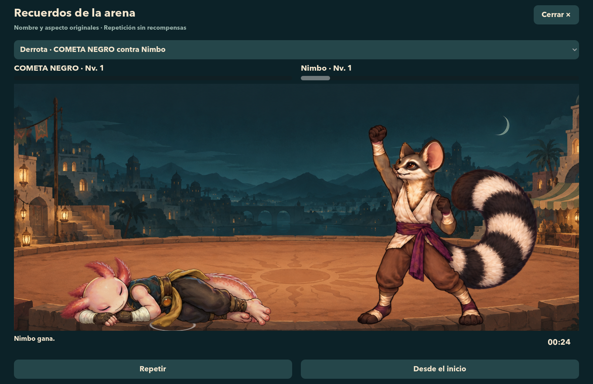

# Personalization · a distinct identity for your companion

This document preserves the catalog, visual scope and evidence of the original customization delivery. The current status of Arena and Cloudflare is at [Arena online](ARENA-ONLINE.md) and [Cloudflare deployment](../backend/docs/DEPLOYMENT.md); subsequent animations are documented in [Animation Sequences](ANIMATION-SEQUENCES.md). The following results were not repeated during Cloudflare's publication.

Brasa allows you to choose the name and appearance of each companion, keep them when closing the game and see them in League, Story, battles and replays. The archetype still defines how you fight: dressing Tepa in Luma's body retains Tepa's techniques, growth, and stats.

## How to use it

In a new game, the creator allows you to choose **combat base**, name, body, palette, effects and presentation. **Create Companion** leads to Story, with the campaign and its three starting points. The base identifies the style of play; the body is an independent visual choice.

In an existing game, open **Menu → Customize**, or use **Customize** from the **Companions** tab. The editor has animated preview, categories, combinations and random variation between owned options. The changes are a draft until you press **Save changes**; **Cancel** keeps the saved name and appearance. During a fight it is not allowed to open the edition.

New names support between **2 and 24** Unicode letters or numbers, spaces, straight apostrophes, and hyphens. Consecutive spaces are reduced to one; controls and reserved names are rejected. Two peers or accounts can have the same name: the internal identifier is independent and stable.

### Desk



### Vertical mobile



The screenshots use a demo fixture: base Mugo, body Balam, Jade palette and Lantern aura. The unlocks were enabled only on that fixture; In the normal game the requirements described below apply.

## before and after

| Appearance | Before | now |
| --- | --- | --- |
| Start of game | Partner and name selection. | Creator with combat base, name, body, palette, effects and presentation; continued in Story Mode. |
| Appearance | Illustration associated with the character. | Thirteen bodies combinable with cosmetics defined in the catalog. |
| Name between modes | Names within the League and Story Mode profiles. | An identity per archetype shared by both modes; each mode retains its progression. |
| Confirmation | Without a complete visual editor. | Preview and draft; save or cancel explicitly. |
| Story Mode | Result and data of the fight. | New fights also retain name, ID, appearance and events for visual repetition. |
| Online preparation | No identity service. | Local Worker+D1 with development accounts, validated inventory, and persistent tokens; no publishing or full PvP. |

## Catalog and unlocks

The catalog has **29 options** counting the original and "no effect" variants. Additional poses and animations present existing images; They do not add techniques or modify their combat times.

| Category | Options |
| --- | --- |
| Body 13 | Nima, Luma, Mugo, Sira, Iria, Duna, Kiro, Neris, Taro, Balam, Tepa, Xuna and Copal. |
| Palette 5 | Original, Jade, Sunset, Moon and Ink. |
| Aura 4 | None, Lantern, Fireflies and Crown. |
| Wake · 3 | None, Brasa and Jade Stele. |
| Victory 2 | Classic and Greeting. |
| Entry 2 | Classic and Pulse. |

All thirteen bodies, Original/Jade/Nightfall, no aura/wake, and both victory/entry presentations are available from the start. The other seven options are obtained by playing:

| Reward | Requirement |
| --- | --- |
| Moon Palette | Reach character level 10 in League or Story. |
| Ink Palette | Win 10 League matches with a partner. |
| Aura Lantern | Complete the 8 Story Mode encounter. |
| Wake Brasa | Complete the 20 Story Mode encounter. |
| Fireflies Aura | Complete the 50 Story Mode encounter. |
| Crown Aura | Complete the 100 Story Mode encounter. |
| jade stele | Win 25 League matches with a partner. |

Conditions are checked on a partner's valid progress; Victories from different profiles are not added to reach a threshold. Once obtained, the cosmetic belongs to the shared local inventory and can be used on other companions. It is not consumed when equipped. Locked combinations show your requirement. There are no purchases or monetization.

**Visual scope of that delivery:** The original illustrated atlases with their eight poses are reused. The palette applies a soft tint to the entire illustration. There are no separate layers to recolor clothing, hair or accessories separately. Aura, trail and presentation are added around those poses. This expansion did not require generating new images.

## Progress, saves and previous games

The identity is saved in an additional file next to the main save:

```text
~/Library/Application Support/BrasaLiga/brasa_save.json.identity.json
```

With a custom save path `<save>.identity.json` is used. Contains the local account, fighter IDs, names, appearances and inventory; **does not contain or replace the levels, XP, attributes, techniques or talents** of the thirteen profiles. League and Story Mode maintain their independent files and progressions. Changing body, name or effects does not add power or alter statistics, range or combat rules.

The migration preserves existing names. If League and Story Mode have different custom names for the same archetype, League is retained; If Liga maintains the original name and only Story Mode personalized it, Story Mode is preserved. Old names are respected even if they do not comply with the new rule, as long as they are not modified. Renaming does not change the fighter's ID or creation date.

The identity file is validated before and after writing, uses a temporary and atomic replacement, and preserves the previous version at `.bak`. A lock and hash check prevent two windows from overwriting other people's changes. In case of corruption, unknown version or conflict, the file is preserved and the customization is protected; there is no attempt to rebuild it by erasing progress. The tests use files independent of the actual game.

## Fights and replays

When the fight starts, the identity of each participant is copied along with their appearance and combat data. HUD, score, and registration use that copy. A subsequent name or team change does not rewrite what happened.

In **Menu → Story Mode → View Replays**, new fights can be replayed with the recorded poses and events. Replay shows names and bodies from that moment, allows you to review the action, and **does not grant XP, wins, or rewards**. The old records are still readable; historical events or images that were never saved are not invented.



## Workers and D1 local service

Authorized preparation works on **`http://127.0.0.1:8787`**, using Wrangler and local D1. Includes stable UUIDs, canonical catalog, inventory per account, creating/reading fighters, atomic name/appearance change, and persistent view of an opponent even if its owner is offline. The optional Godot adapter is [IdentityApi](../scripts/identity_api.gd).

The account is provisioned with a local tool: private random token, hash on D1, expiration and revocation. The server validates owner, revision, category, ID, compatibility and possession; the client cannot grant itself cosmetics or send resource paths or shaders. Two simultaneous editions with the same revision produce a single accepted change. The snapshot server module only copies existing fighters and retains their catalog hash for historical readings.

**In this historical installment the service had not been published.** There was still no production login, matchmaking or a PvP executor. The game does not automatically upload your gameplay or rewards to the service, and local D1 accounts are not automatically linked to the Godot identity file. The opponent view and snapshots prepare for that future integration; They do not represent already implemented online games.

Boot, credentials, endpoints, errors and tests are in [backend/README.md](../backend/README.md). The backend is excluded from Godot import/export and its credentials and temporary data are not part of the distribution files.

## Sources and validation

The [canonical catalog](../data/cosmetic_catalog.json) is the export of [CosmeticCatalog](../scripts/cosmetic_catalog.gd), shared with the backend. The [FighterIdentity](../scripts/fighter_identity.gd) code separates identity and progress; [BattleIdentity](../scripts/battle_identity.gd) retains historical copies.

| Test | What does it check? |
| --- | --- |
| [test_fighter_identity.gd](../tests/test_fighter_identity.gd) | Names, IDs, migration, unlocks, saving, write failures and progress retention. |
| [test_identity_integration.gd](../tests/test_identity_integration.gd) | Creator, Editor, League/Story, HUD, Combat, Story Mode and Replay without rewards. |
| [test_identity_edges.gd](../tests/test_identity_edges.gd) | Protected identity, save failures, incomplete snapshots, and invalid API responses. |
| [test_customization_visuals.gd](../tests/test_customization_visuals.gd) | Visual variants and adaptation of the editor/combat to seven sizes. |
| [test_identity_api.gd](../tests/test_identity_api.gd) | Actual Godot requests to local Worker+D1 and rejections 401/403/409/422. |
| [backend/tests](../backend/tests) | Authentication, HTTP limits, permissions, atomicity, races, persistence, hashes and snapshots. |

Confirmed final results of that delivery:

| Set | Result |
| --- | --- |
| Godot final regression, 24 windowless suites | **22.816 checks, 0 failures**. |
| Identity, migration and inventory | **894 checks, 0 failures**. |
| Editor and visual variants with native render | **1.866 checks, 0 failures**. |
| Final integration with native render | **85 checks, 0 failures**. |
| Worker + local D1 | **15 tests, 0 failures**. |
| Godot → Real Wrangler HTTP | **15 checks, 0 failures**. |
| Complete interface tour | **UI_SMOKE_PASS**. |

The addition of 22.816 already includes identity integration (80), its edge cases (28), Story Mode integration (85), motion presentation (751), and clock (148); They don't add up again. The final results from the `.log` files were used, including the final native render, and not previous intermediate results.

Seven sizes were tested: 1360×880, 1224×792, 1920×1080, 768×1024, 390×844, 430×932 and 844×390. The screenshots come from native renders with fixtures, without modifying the user's game.

The [final check](customization-validation.json) records code hashes and screenshots, test results, and comparison of actual saves when reopening this version. The League and Story Mode files remained identical byte for byte.
