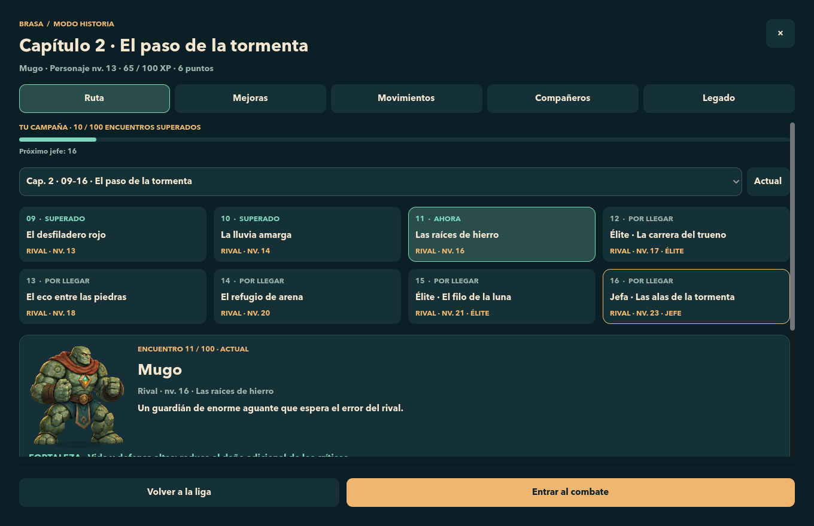
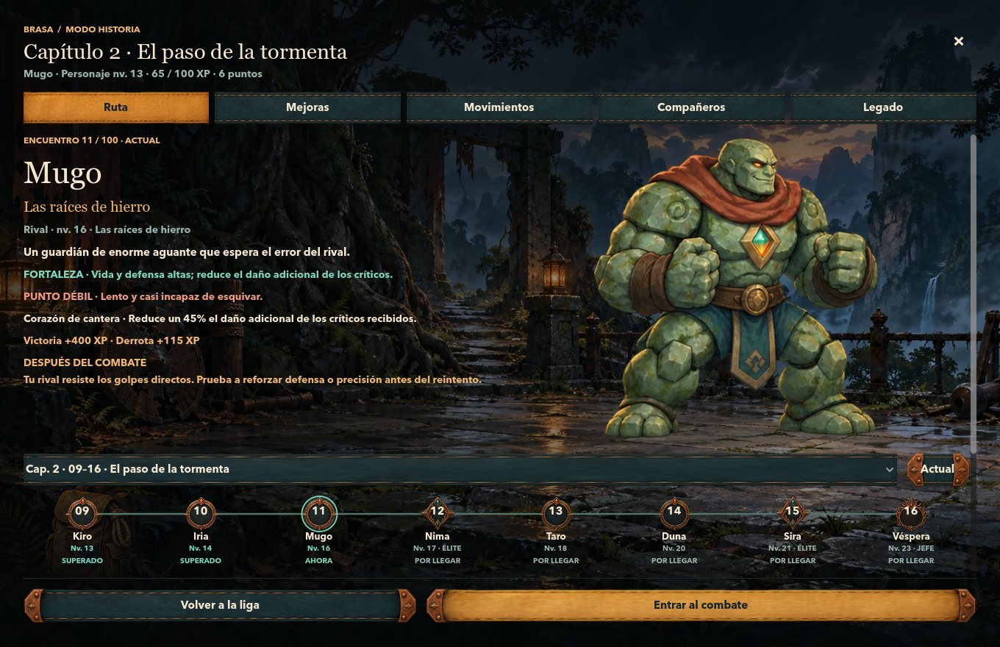
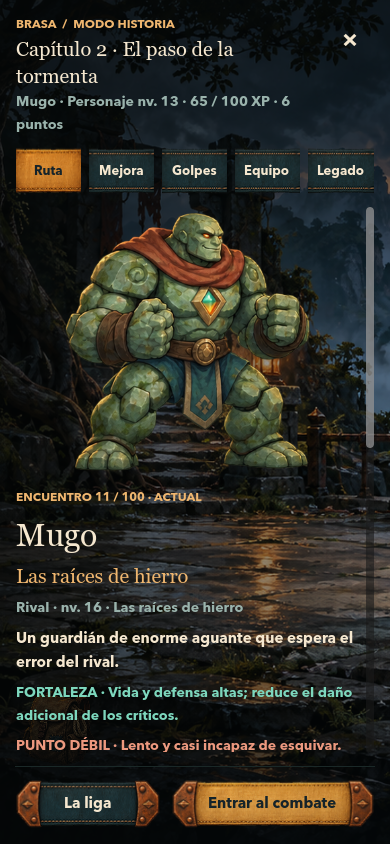
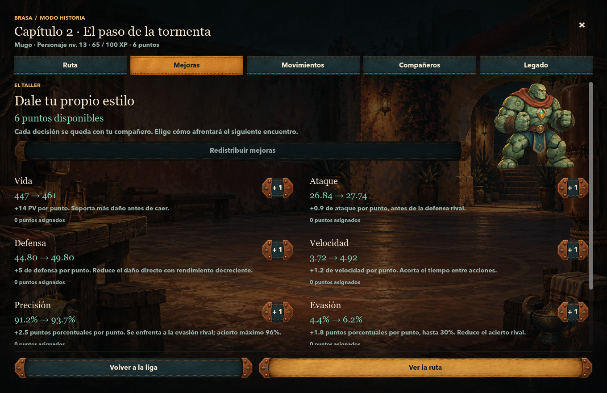
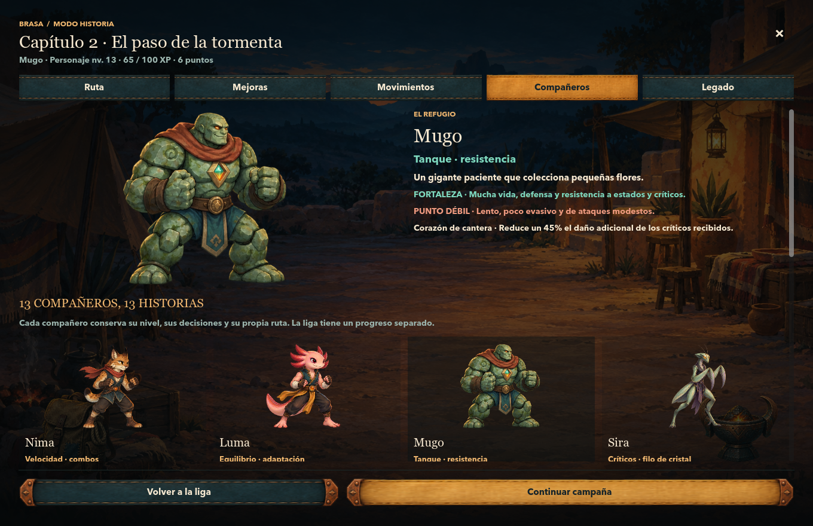
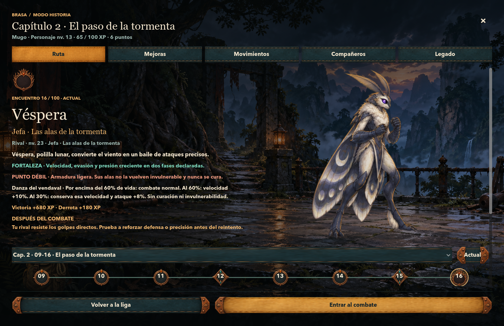
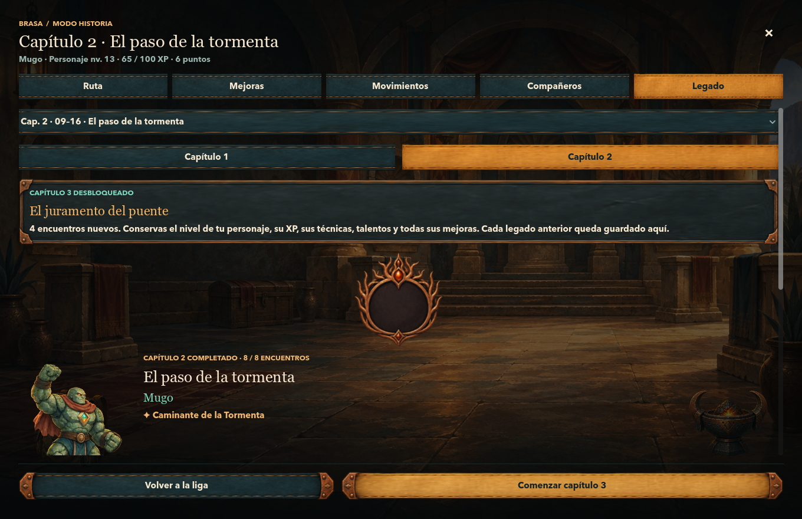
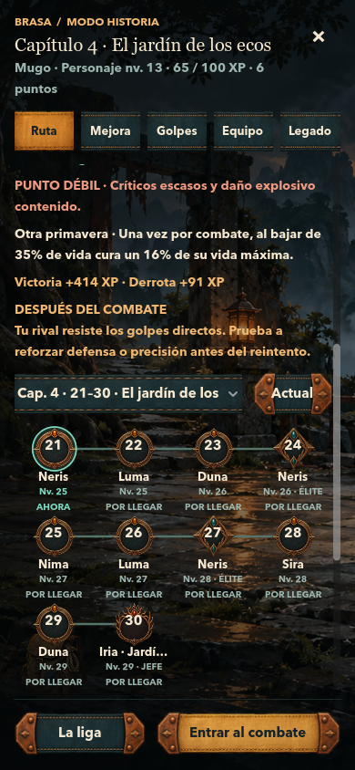

# Historia dentro del mundo de Brasa

Rediseño integrado de las cinco secciones de Historia. Godot sigue controlando textos, navegación, estadísticas, progreso y acciones; siete imágenes originales aportan los escenarios, superficies y objetos. La auditoría y el plan anteriores a la implementación están en [UI-WORLD-PLAN.md](UI-WORLD-PLAN.md).

## Antes y después

| Elemento | Antes | Después |
| --- | --- | --- |
| Ruta | Fondo plano y cuadrícula de tarjetas antes de la ficha del rival | Entorno ilustrado, rival protagonista y sendero de hitos conectados |
| Capítulos y jefes | Presentación casi idéntica | Faroles o raíces y tormenta; jefes con mayor escala, emblema y luz contextual |
| Mejoras y Movimientos | Tarjetas de estadísticas y técnicas | Taller de entrenamiento, filas abiertas, personaje y controles de inversión nativos |
| Compañeros | Plantel de tarjetas y descripción secundaria | Refugio, compañero seleccionado en gran formato y plantel debajo |
| Legado | Bloques uniformes de datos | Archivo ilustrado, medallón y recuerdos con datos de cada capítulo |
| Botones y marcos | Rectángulos planos generados por código | Familia de cuero, tejido y cobre que se adapta mediante nueve segmentos |
| Navegación pequeña | Controles compactos sin lenguaje propio | Correas del mismo atlas, sin remates que invadan las etiquetas móviles |
| Decoración | Sin pertenencias contextuales | Hasta tres objetos elegidos según cuerpo, cosméticos, encuentros superados y victorias de Liga |
| Composición adaptable | Rival pequeño después del mapa | Rival junto al texto en escritorio, encima en vertical y acciones siempre accesibles |

## Capturas del juego

Las imágenes siguientes son capturas nativas de Godot con partidas de prueba aisladas. El caso principal conserva Capítulo 2, Mugo y «Las raíces de hierro». No se modificó la partida del usuario para obtener estas vistas.

## Arte y sistema

Cinco fondos: Faroles, Tormenta, Taller, Refugio y Archivo. Dos atlas transparentes: superficies/insignias y objetos. Los PNG originales se conservan; las regiones y los estilos viven en [ui_visual_manifest.json](../data/ui_visual_manifest.json). Todos los rótulos, números y valores siguen siendo texto nativo.

El manifiesto ofrece once contextos reutilizables, incluidas variantes de jefe por capítulo. Los capítulos posteriores reutilizan el entorno de Tormenta con un tratamiento cromático distinto; esta entrega no crea once fondos únicos. Mejoras y Movimientos comparten el taller con distinta luz.

Los objetos usan condiciones declarativas y prioridades. El uniforme de Tepa y las vendas de Balam siguen el cuerpo equipado. El brasero recuerda a Ascua; la reliquia requiere progreso y su cosmético; la mochila acompaña el viaje; una medalla aparece tras diez victorias de Liga. Los objetos ignoran ratón/foco y no conceden recompensas.

Sólo se retiene el fondo de la sección actual y los dos atlas compartidos. La liberación del fondo anterior se verificó con referencias débiles. No se añadieron partículas, shaders ni animación ambiental. Los estados normal, hover, pulsado, foco y deshabilitado continúan siendo nativos, con fallback si falta una superficie esencial.

Se utilizó la herramienta integrada de imágenes de ChatGPT. No expone un selector de versión «2.5»; no se atribuye esa versión al resultado. [GENERATION-PROMPTS.json](../assets/ui/GENERATION-PROMPTS.json) contiene los siete prompts completos, destinos y hashes. La [dirección de arte](../assets/ui/ART-DIRECTION.md) describe materiales, luz y criterio de integración.

## Validación

Resultado final: **3.824 comprobaciones en nueve ejecuciones, cero fallos y cero errores del motor**, con 63 capturas nativas de Historia. Los siete PNG generados conservan sus hashes originales, al igual que los siete archivos de partida y respaldo registrados al inicio.

Se comprobaron 1360×880, 1224×792, 1920×1080, 768×1024, 390×844, 430×932 y 844×390. Se revisaron el rival de capítulo 2, el jefe, la ruta inicial, los capítulos de diez encuentros, el archivo completado y las cinco secciones. En formatos pequeños el cuerpo desplaza verticalmente; el pie conserva sus acciones. El texto completo de nombres largos de hitos queda disponible en su vista previa y tooltip.

Las regresiones cubren asignación de puntos, técnicas, talentos, selección de compañeros, reintento, práctica, entrada al combate, cambio de capítulo, legado, identidad, persistencia y regreso a Liga. La evidencia final y las cifras por suite quedan en [ui-world-validation.json](ui-world-validation.json).

La capa decorativa no cambia reglas, XP, recompensas ni formato de guardado. `main.gd` sólo añade el paso de las victorias del plantel a la vista. Se compararon los hashes de los módulos de juego y los siete archivos de partida y respaldo registrados antes del cambio.

El alcance es Historia y su sistema visual reutilizable. La arena de combate, el editor de personajes y la interfaz online conservan su presentación actual.
