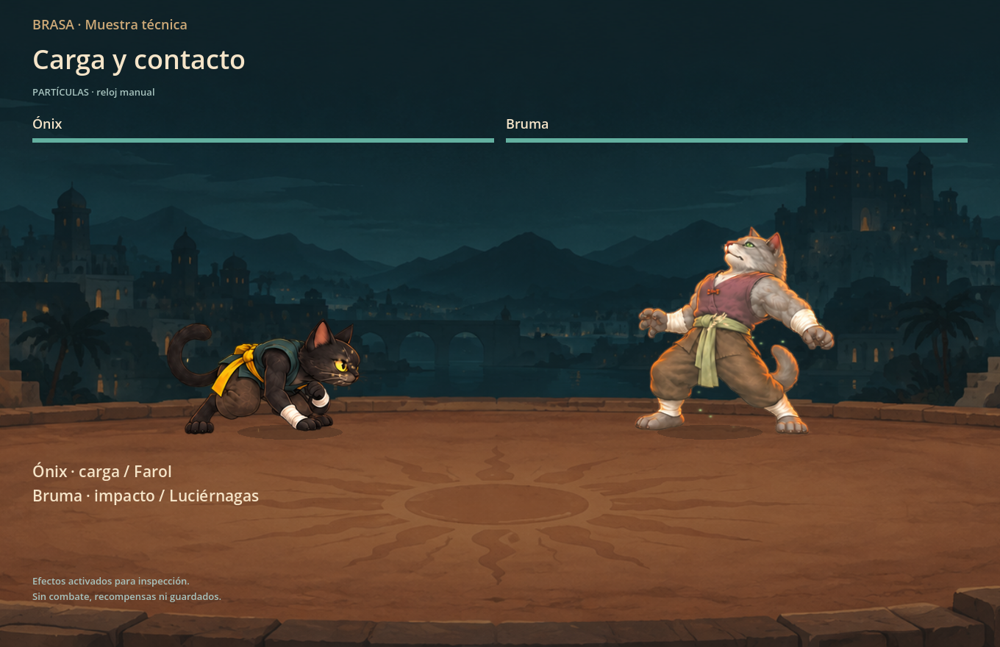
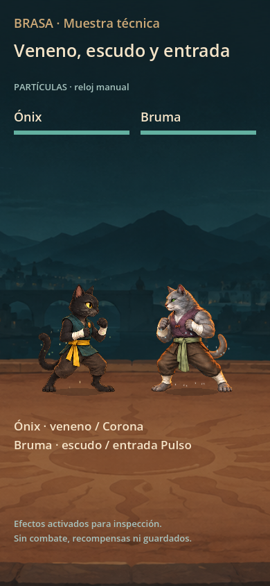

# Revisión visual de partículas orgánicas

El muestrario usa `FighterView` y `CombatFX` reales sobre el fondo ilustrado de Brasa. Sus gestos se activan deliberadamente y el reloj de presentación se avanza a mano: son muestras técnicas, no grabaciones de combates naturales. La prueba de repetición sí obtiene sus eventos del motor real, ejecutado en memoria, y controla únicamente la reproducción histórica. Ninguna escena inicia Main ni abre una partida o identidad del usuario.

Se conservan cuatro encuadres en 1360×880 y 390×844: carga/contacto con Farol y Luciérnagas; Ascua transformándose y Luma con quemadura; veneno, escudo, Corona y entrada Pulso; salto, polvo y desplazamiento. El vídeo también incluye un impacto pequeño y curación. Las capturas de pausa y movimiento reducido emplean el panel de repetición de producción.

| Antes | Después |
| --- | --- |
| El atlas radial podía envolver el torso y cubrir la cabeza de Ascua. | Emisión pequeña junto al cuerpo; partículas libres con deriva y desvanecimiento. |
| Auras e introducción trazaban contornos circulares. | Motas y chispas discretas alrededor de espalda y pies, con luz tenue sobre la ilustración. |
| Comparación difícil si cambiaba el tamaño del personaje. | Mismo reloj, fondo, encuadre y escala en ambos juegos de ocho capturas. |

La referencia anterior se compila desde las copias de `fighter-before.gd` y `combat_fx-before.gd`, sin restaurar código de producción. El FX antiguo usa expresamente `combat_fx-before.json`, con los tamaños originales 124/170 de carga/transformación. No se han modificado píxeles de ningún atlas ni de las capturas; Godot escribe cada PNG directamente.

El test independiente comprueba anclajes al saltar y agacharse, reflejo de mano/pecho/espalda/pies al cambiar de orientación, independencia de las partículas ya liberadas, cotas respecto al HUD y al escenario, presupuesto máximo, pausa/reanudación, movimiento reducido e invariancia de eventos históricos. Ejecuta presentación con pasos de 20, 60 y 120 FPS; esto verifica estados finitos, presupuestos y extinción, no una medida de rendimiento del dispositivo ni equivalencia exacta de cada emisión móvil entre tasas.

Comandos reproducibles desde la raíz del proyecto:

```sh
/Applications/Godot.app/Contents/MacOS/Godot --headless --path outputs/Brasa --script res://tests/test_organic_fx.gd
/Applications/Godot.app/Contents/MacOS/Godot --path outputs/Brasa --script res://tests/test_organic_fx.gd -- --baseline --capture-dir="$PWD/work/organic-fx/before"
/Applications/Godot.app/Contents/MacOS/Godot --path outputs/Brasa --script res://tests/test_organic_fx.gd -- --capture-dir="$PWD/work/organic-fx/after"
/Applications/Godot.app/Contents/MacOS/Godot --path outputs/Brasa --script res://tests/test_organic_fx.gd -- --capture-dir="$PWD/work/organic-fx/after" --video-only
```

Resultado final: **185 comprobaciones nativas, 0 fallos** en [test-organic-native.log](test-organic-native.log). Incluye doce capturas finales: cuatro muestras y dos estados de repetición para cada tamaño. La comparación anterior tiene ocho capturas, generadas por separado con el mismo encuadre. Las 172 comprobaciones de la pasada sin render son un subconjunto; no se suman a las 185.

La inspección final confirma granos visibles y discretos, sin aros de fuego ni halos envolventes. Farol, Luciérnagas, Corona y Pulso conservan señales pequeñas alrededor de espalda/pies; los estados dejan motas próximas a manos y cuerpo. La cabeza de Ascua queda despejada. El salto completo cabe bajo el HUD del muestrario. En móvil los efectos siguen siendo sutiles y se distinguen mejor en movimiento que en una imagen fija; no intentan representar llamas grandes.

[Comparación anterior](before/observations.json) · [Muestras finales y datos](after/observations.json) · [Prueba](../../outputs/Brasa/tests/test_organic_fx.gd).





Vídeos finales: [escritorio](organic-fx-desktop.mp4) y [móvil](organic-fx-mobile.mp4), cada uno con 96 fotogramas nativos a 30 FPS y 3,2 segundos, sin audio. FFmpeg codifica directamente la secuencia PNG; no se altera ningún atlas ni PNG. La exportación separada terminó con 12 comprobaciones de construcción de las muestras y 0 fallos; no se suma a la suite funcional. [Manifiesto y hashes finales](visual-validation.json).
